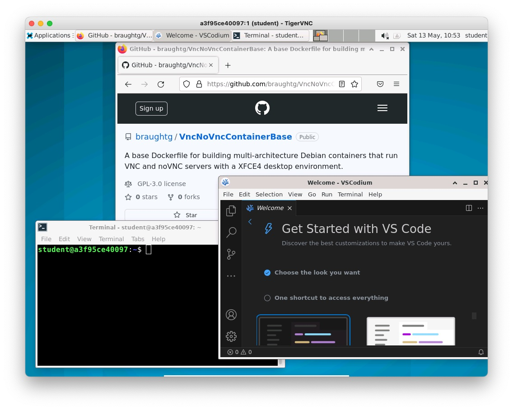

# CourseContainerTemplate

This Template Repository provides tools for quickly creating Debian based course/application specific Docker containers that can be used as a virtual machine.  

Images such as these are ideal for providing fully configured development or course environments.  For example:
* An environment for teaching the linux/Unix command line.
* Providing a fully configured web server, database and API framework for a full stack web development course.
* Providing particular compilers, assemblers, etc... for a course that requires specialized tools.
* Etc.

The Docker container created by this Template runs Debian Linux with an XFCE4 desktop environment and appears as shown here when in use.



## Requirements

The requirements for creating, testing, and using the image produced by this Template are:
* [Docker Desktop](https://docs.docker.com/desktop/install/windows-install/)
  * Or [Docker Engine on Linux](https://docs.docker.com/engine/install/)
* A VNC client (recommended)
  * E.g. [Tiger VNC](https://sourceforge.net/projects/tigervnc/files/stable/)
  * Note: The noVNC server allows the container to be accessed via a web browser.  However, the user experience is much better when using a full VNC client.
* A [Dockerhub Account](https://hub.docker.com/)
  * A dockerhub account is necessary for sharing the image. Users/students will not need a dockerhub account.

## Quick start

The following instructions will have you build the default image, create a container and connect to it.  It provides the fastest way to get a working container up and running to try it out and see if it will be suitable for your use. Later instructions will describe how to customize the container to your specific purposes.

1. Create a new repository using this template.
2. Build the image using the command:
   ```
   ./build.bash -d
   ```
3. Create a new container from the image using the command:
   ```
   docker create --name CourseContainer --publish 5901:5901 --publish 6901:6901 somebody/course-container:0.0.0
   ```
4. Start the container using Docker Desktop or using the command:
   ```
   docker start CourseContainer
   ```
5. Connect to the container:
   * Using a VNC Client (recommended):
  
     Start your VNC Client and connect to:
     ```
     localhost:5901
     ```

     The XFCE4 desktop should appear in the VNC Client window.

   * Using a browser (quick):

     Open the browser and connect to the URL: 
     ```
     https://localhost:6901
     ```

     The XFCE4 desktop should appear in the browser window.  
 
     Some tips for using the container via noVNC:
     * The noVNC menu (the little tab on the left side of the desktop) provides some helpful functionality.
     * To copy/paste between the host machine and the container you must use the clipboard accessed via the noVNC menu. This is a little inconvenient, but it is functional.
     * To enable the XFCE4 desktop to scale with the browser window, use the settings (the the gear) on the noVNC menu to set the “Scaling Mode” to “Remote Resizing.”
6. Stop the container using Docker Desktop or using the command:
   ```
   docker stop CourseContainer
   ```
7. If desired, you can delete the default Course Container and image using Docker Desktop or by using the following commands.
   ```
   docker rm CourseContainer
   docker image rm somebody/course-container:0.0.0
   ```

## Container credentials

When connecting to the container the default user is automatically logged in.  No credentials will need to be provided to connect to the client. 

The default user has the following credentials:
* Username: `student`
* Password: `student`

Note that the `student` user has `sudo` privileges within the container and the password will be required to run commands with `sudo`.

## Customizing the image

To customize the image:

1. Edit the following lines in the `config.bash` script to reflect your information:
   ```
   DOCKER_HUB_USER="somebody"
   IMAGE="CourseContainer"
   TAG="0.0.0"
   PLATFORMS=linux/amd64,linux/arm64
   ```
2. Add to the `root.bash` script to install any system wide software that is needed and to do any configuration that requires `root` privileges.  One effective strategy is to work in a Terminal in the container to work out the details of what to install and how to do the configuration.  Then transfer the necessary commands to this script.
3. Add to the `student.bash` script to do any installations or configuration that should be done as the `student` user.
4. Add to the `launch.bash` script to start any services or servers that need to be started when the container starts (e.g. Apache, etc...)
5. Run `build.bash -d` 
6. Create a new container from the image by adapting the following command based on your information from step #1.  Change `<container name>` to be a name you would like to give the container.
   ```
   docker create --name <container name> --publish 5901:5901 --publish 6901:6901 <DOCKER_HUB_USER>/<IMAGE>:<TAG>
   ```
7. Start the container using Docker Desktop or by adapting the following command.  Change `<container name>` to whatever name you used in the previous step.
   ```
   docker start <container name>
   ```
8. Connect to the container using VNC or a browser as described above in the Quick Start section.
9. Delete the container and image between builds as necessary for testing and debugging by adapting the following commands.
   ```
   docker rm <container name>
   docker image rm <DOCKER_HUB_USER>/<IMAGE>:<TAG>
   ```

## Building multi-architecture images and pushing dockerhub

When you have debugged and tested an image and are ready to share it:

1. Log into dockerhub as the user you specified in `config.bash`:
   ```
   docker login
   ```
2. Run the command:
   ```
   ./build.bash
   ```
   Notice: There is no `-d` here.  This will cause images to be built for all of the `PLATFORMS` listed in `config.baah`.  The resulting images will then be pushed to dockerhub.

## A note on persistence of container data

The container created by the `create` command above works well for most basic use cases. It persists changes to the container (e.g. user installed software, changes within the `student` home directory) in the writeable layer of the container.  Thus, all changes are preserved across container stops and starts, so long as the container is not deleted.  If the container is deleted all changes will be lost. 

If greater persistence is desired it is possible to preserve the changes within the `student` home directory across container deletions using either a Docker volume or on the file system of the host machine.  

To preserve the `student` home directory in a Docker Volume adapt the following `mount` flag and add it to the `docker create` command used to create the container:

```
--mount type=volume,source=<volume name>,target=/home/student
```

To preserve the `student` home directory on the host machine file system adapt the following `mount` flag and add it to the `docker create` command used to create the container:

```
--mount type=bind,source=<host directory path>,target=/home/student
```

## More details

For all of the details about what is behind this Template Repository see the [VncNoVNCContainerBase](https://github.com/braughtg/VncNoVncContainerBase) repo. It describes the creation of the base image for the images created using this template.  This will be useful if you find that you need to modify the base image in ways that are not easily accomplished via the `config.bash`, `root.bash`, `student.bash` and `launch.bash` scripts.
